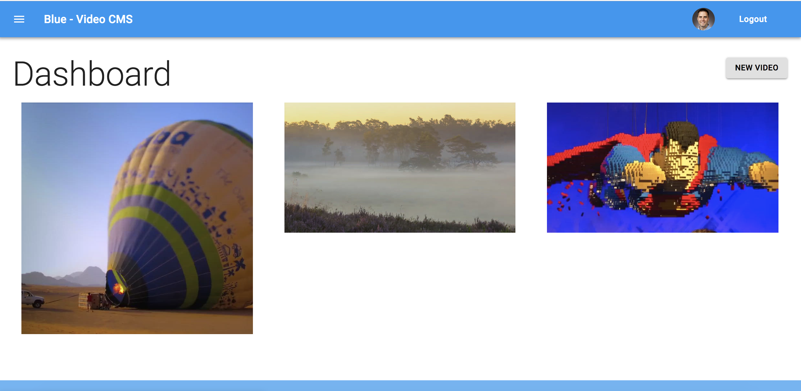
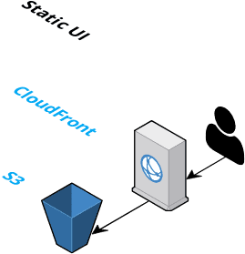
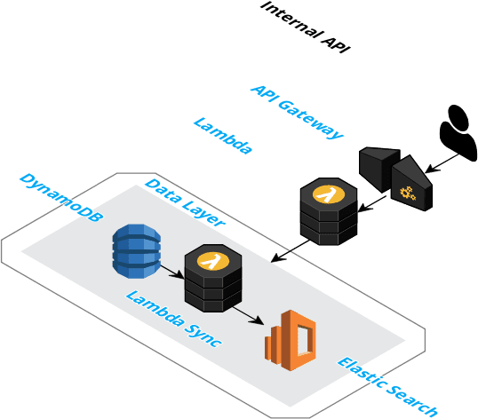
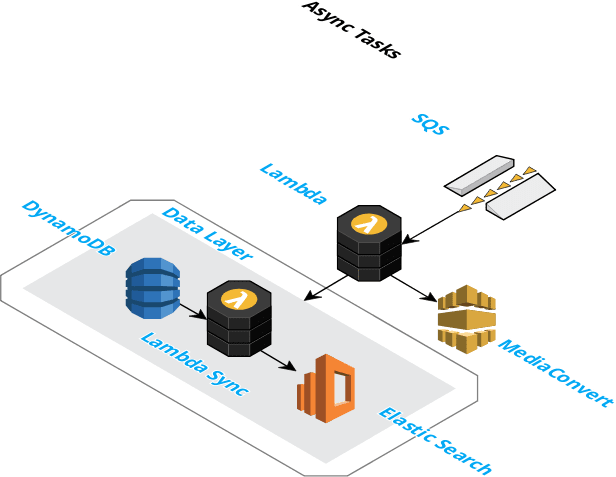
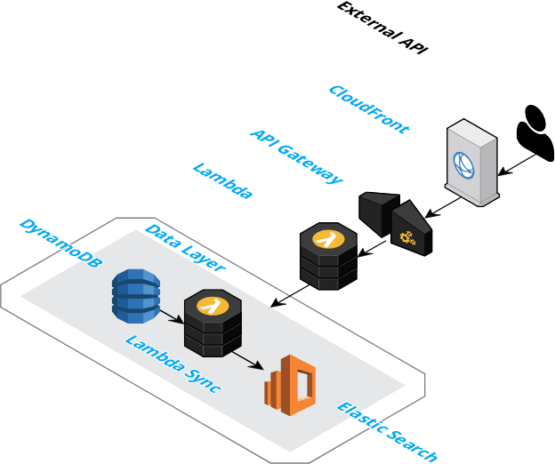

# Video CMS
Open Source Video CMS - Serverless - AWS Elemental

## UI
React based SPA.

## Internal API
Private API used by the UI.  Authentication via Google.  Authorization via JWT.

## Async Tasks
Video encoding by AWS Elemental MediaConvert via async task queue.

## External API
Public API used by external apps, webpages, etc...

